Assignment 1: R markdown template
================

### **Load packages**

To start, load all the required packages with the following code.
Install them if they are not installed yet.

``` r
library(tidyverse)
library(knitr)
```

### **Exercise 1. Corruption and human development**

This exercise explores a dataset containing the human development index
(`HDI`) and corruption perception index (`CPI`) of 173 countries across
6 different regions around the world: Americas, Asia Pacific, Eastern
Europe and Central Asia (`East EU Cemt`), Western Europe (`EU W.
Europe`), Middle East and North Africa and Noth Africa (`MENA`), and
Sub-Saharan Africa (`SSA`). (Note: the larger `CPI` is, the less
corrupted the country is perceived to be.)

First, we load the data using the following
code.

``` r
economist_data <- read_csv('https://raw.githubusercontent.com/nt246/NTRES-6100-data-science/master/datasets/EconomistData.csv')
```

    ## Warning: Missing column names filled in: 'X1' [1]

    ## Parsed with column specification:
    ## cols(
    ##   X1 = col_double(),
    ##   Country = col_character(),
    ##   HDI.Rank = col_double(),
    ##   HDI = col_double(),
    ##   CPI = col_double(),
    ##   Region = col_character()
    ## )

**1.1 Show the first few rows of `economist_data`.**

``` r
head(economist_data)
```

    ## # A tibble: 6 x 6
    ##      X1 Country     HDI.Rank   HDI   CPI Region           
    ##   <dbl> <chr>          <dbl> <dbl> <dbl> <chr>            
    ## 1     1 Afghanistan      172 0.398   1.5 Asia Pacific     
    ## 2     2 Albania           70 0.739   3.1 East EU Cemt Asia
    ## 3     3 Algeria           96 0.698   2.9 MENA             
    ## 4     4 Angola           148 0.486   2   SSA              
    ## 5     5 Argentina         45 0.797   3   Americas         
    ## 6     6 Armenia           86 0.716   2.6 East EU Cemt Asia

**1.2 Expore the relationship between human development index (`HDI`)
and corruption perception index (`CPI`) with a scatter plot as the
following.**

``` r
ggplot(data = economist_data) + 
  geom_point(mapping = aes(x = CPI, y = HDI)) 
```

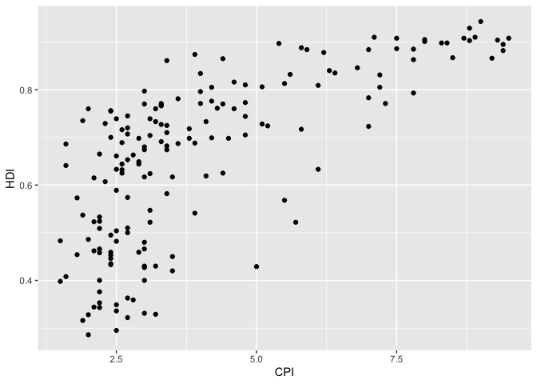<!-- -->

**1.3 Make the color of all points in the previous plot red.**

``` r
ggplot(data = economist_data) + 
  geom_point(mapping = aes(x = CPI, y = HDI, color ="red")) 
```

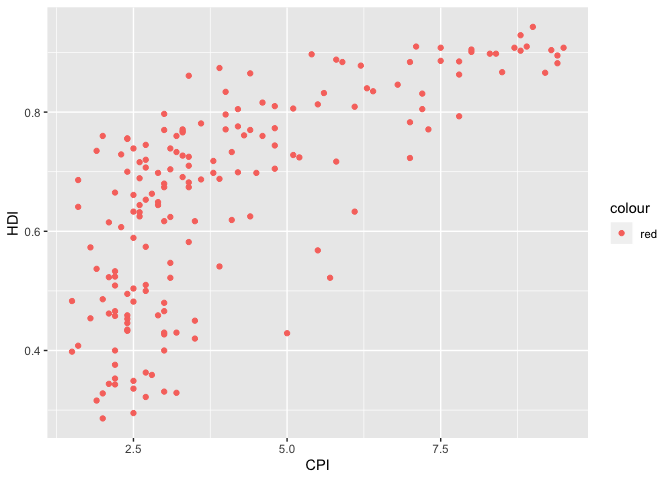<!-- -->

**1.4 Color the points in the previous plot according to the `Region`
variable, and set the size of points to 2.**

``` r
ggplot(data = economist_data) + 
  geom_point(mapping = aes(x = CPI, y = HDI, color = Region, size=2))
```

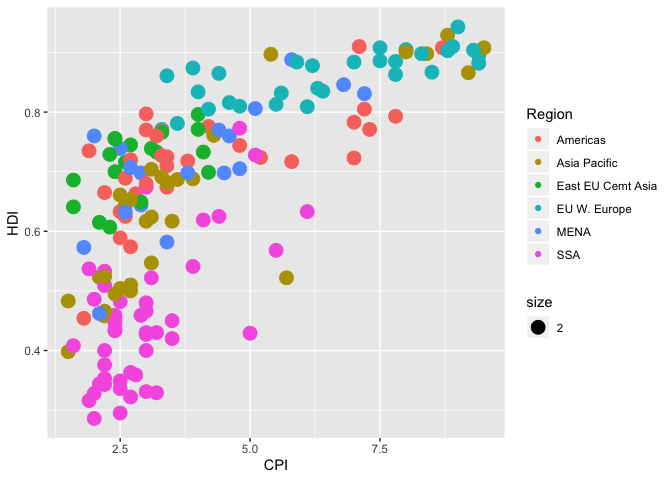<!-- -->

**1.5 Set the size of the points proportional to `HDI.Rank`**

``` r
ggplot(data = economist_data) + 
  geom_point(mapping = aes(x = CPI, y = HDI, color = Region, size = HDI.Rank))
```

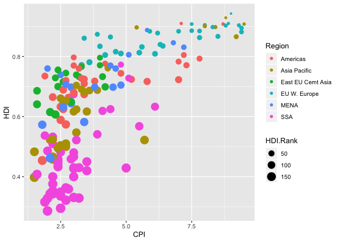<!-- -->

**1.6 Fit a smoothing line to all the data points in the scatter plot
from Excercise 1.4**

``` r
ggplot(data = economist_data) + 
  geom_point(mapping = aes(x = CPI, y = HDI, color = Region, size = HDI.Rank), shape = 16) +
  geom_smooth(mapping = aes(x = CPI, y = HDI))
```

    ## `geom_smooth()` using method = 'loess' and formula 'y ~ x'

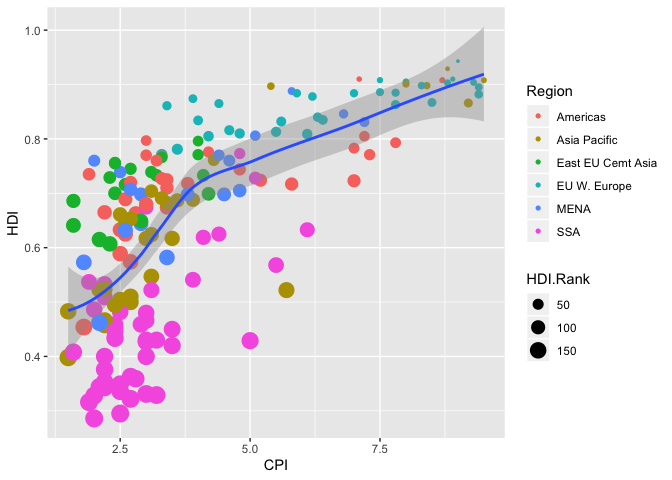<!-- -->

**1.7 Fit a separate straight line for each region instead, and turn off
the confidence interval.**

``` r
ggplot(data = economist_data) + 
  geom_point(mapping = aes(x = CPI, y = HDI, color = Region, size = HDI.Rank), shape = 16) +
  geom_smooth(mapping = aes(x = CPI, y = HDI, color = Region), method = "lm", se = FALSE)
```

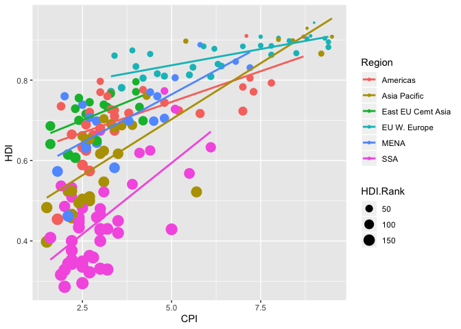<!-- -->

**1.8 Building on top of the previous plot, show each `Region` in a
different facet.**

``` r
ggplot(data = economist_data) + 
  geom_point(mapping = aes(x = CPI, y = HDI, color = Region, size = HDI.Rank), shape = 16) +
  geom_smooth(mapping = aes(x = CPI, y = HDI, color = Region), method = "lm", se = FALSE) +
  facet_wrap(~ Region)
```

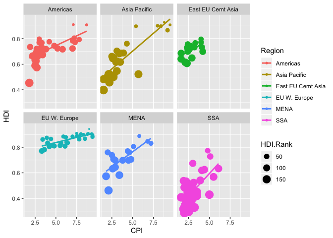<!-- --> **1.9
Show the distribution of `HDI` in each region using density plot. Set
the transparency to 0.5**

``` r
ggplot(data = economist_data) +
  geom_density(mapping = aes(fill = Region, x = HDI), alpha = 0.5)
```

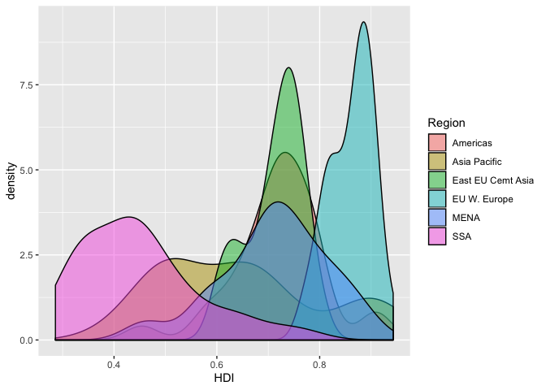<!-- --> **1.10
Show the distribution of `HDI` in each region using histogram and
facetting.**

``` r
ggplot(data = economist_data) +
 geom_histogram(mapping = aes(fill = Region, x = HDI)) +
 facet_wrap(~ Region)
```

    ## `stat_bin()` using `bins = 30`. Pick better value with `binwidth`.

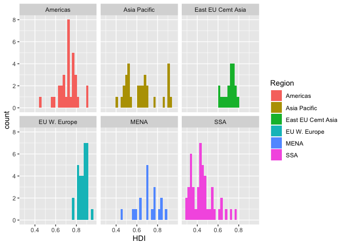<!-- --> **1.11
Show the distribution of `HDI` in each region using a box plot. Set the
transparency of these boxes to 0.5. Also show data points for each
country in the same plot. (Hint: `geom_jitter()` or `position_jitter()`
might be useful.)**

``` r
ggplot(data = economist_data) +
 geom_boxplot(mapping = aes(fill = Region, x = Region, y = HDI, color = Region), alpha = 0.5, outlier.shape = NA) +
  geom_jitter(mapping = aes(x = Region, y = HDI, color = Region))
```

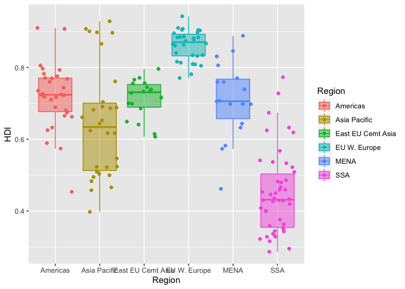<!-- --> **1.12
Show the count of countries in each region using a bar plot.**

``` r
ggplot(data = economist_data) +
  geom_bar(mapping = aes(x = Region))
```

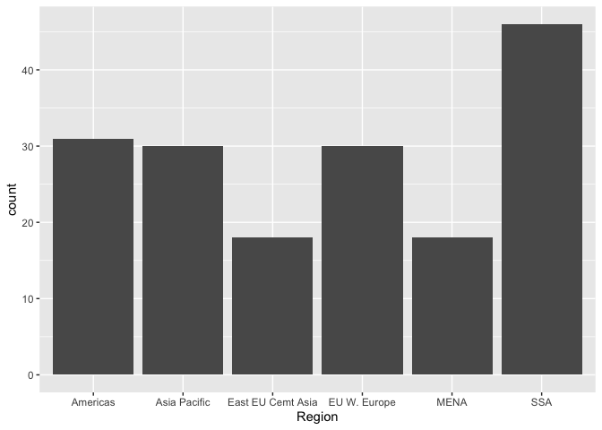<!-- --> **1.13
You have now created a variety of different plots of the same dataset.
Which of your plots do you think are the most informative? Describe
briefly the major trends that you see in the data.** Answer: Ithink that
the graph in 1.8 shows the most, because it provides a nice summary of
human development and process capacity in different regions.

### **Exercise 2. Unemployment in the US 1967-2015**

This excercise uses the dataset `economics` from the `ggplot2 package`.
It was produced from US economic time series data available from
<http://research.stlouisfed.org/fred2>. It descibes the number of
unemployed persons (`unemploy`), among other variables, in the US from
1967 to 2015.

``` r
kable(head(Theoph))
```

| Subject |   Wt | Dose | Time |  conc |
| :------ | ---: | ---: | ---: | ----: |
| 1       | 79.6 | 4.02 | 0.00 |  0.74 |
| 1       | 79.6 | 4.02 | 0.25 |  2.84 |
| 1       | 79.6 | 4.02 | 0.57 |  6.57 |
| 1       | 79.6 | 4.02 | 1.12 | 10.50 |
| 1       | 79.6 | 4.02 | 2.02 |  9.66 |
| 1       | 79.6 | 4.02 | 3.82 |  8.58 |

For the following exercies, transform the data as instructed. Try to use
tidyverse functions even if you are more comfortable with base-R
solutions. Show the first 6 lines of the transformed data in a table
through RMarkdown **using the kable() function**, as shown above.

**2.1 Select columns that contain a lower case “t” in the Theoph
dataset. Do not manually list all the columns to include.**

``` r
Theoph %>%
  select(contains("t", ignore.case=FALSE)) %>%
  head(6) 
```

    ##   Subject   Wt
    ## 1       1 79.6
    ## 2       1 79.6
    ## 3       1 79.6
    ## 4       1 79.6
    ## 5       1 79.6
    ## 6       1 79.6

**2.2 Rename the ‘Wt’ column to ‘Weight’ and conc column to
‘Concentration’ in the ‘Theoph’ dataset.**

``` r
Theoph %>%
  mutate(Weight = Wt, Concentration = conc) %>%
  select(-Wt, -conc) %>%
  head(6)
```

    ##   Subject Dose Time Weight Concentration
    ## 1       1 4.02 0.00   79.6          0.74
    ## 2       1 4.02 0.25   79.6          2.84
    ## 3       1 4.02 0.57   79.6          6.57
    ## 4       1 4.02 1.12   79.6         10.50
    ## 5       1 4.02 2.02   79.6          9.66
    ## 6       1 4.02 3.82   79.6          8.58

``` r
Theoph %>%
  rename(Weight = Wt, Concentration = conc) %>%
  head(6) 
```

    ##   Subject Weight Dose Time Concentration
    ## 1       1   79.6 4.02 0.00          0.74
    ## 2       1   79.6 4.02 0.25          2.84
    ## 3       1   79.6 4.02 0.57          6.57
    ## 4       1   79.6 4.02 1.12         10.50
    ## 5       1   79.6 4.02 2.02          9.66
    ## 6       1   79.6 4.02 3.82          8.58

**2.3 Extract the ‘Dose’ greater than 4.5 and ‘Time’ greater than the
mean ‘Time’.**

``` r
Theoph %>%
  filter(Dose > 4.5, Time > mean(Time)) %>%
  head(6)
```

    ##   Subject   Wt Dose  Time conc
    ## 1       3 70.5 4.53  7.07 5.30
    ## 2       3 70.5 4.53  9.00 4.90
    ## 3       3 70.5 4.53 12.15 3.70
    ## 4       3 70.5 4.53 24.17 1.05
    ## 5       5 54.6 5.86  7.02 7.09
    ## 6       5 54.6 5.86  9.10 5.90

**2.4 Sort the ‘Theoph’ dataset by ‘Wt’ from smallest to largest and
secondarily by ‘Time’ from largest to smallest.**

``` r
Theoph %>%
  arrange(Wt, -Time) %>%
  head(6)
```

    ##   Subject   Wt Dose  Time conc
    ## 1       5 54.6 5.86 24.35 1.57
    ## 2       5 54.6 5.86 12.00 4.37
    ## 3       5 54.6 5.86  9.10 5.90
    ## 4       5 54.6 5.86  7.02 7.09
    ## 5       5 54.6 5.86  5.02 7.56
    ## 6       5 54.6 5.86  3.50 8.74

**2.5 Create a new column called ‘Quantity’ that equals to ‘Wt’ x ‘Dose’
in the ‘Theoph’ dataset. This will tell you the absolute quantity of
drug administered to the subject (in mg). Replace the ‘Dose’ variable
with ‘Quantity’.**

``` r
Theoph %>%
  mutate(Quantity = Wt*Dose) %>%
  select(-Dose) %>%
  head(6)
```

    ##   Subject   Wt Time  conc Quantity
    ## 1       1 79.6 0.00  0.74  319.992
    ## 2       1 79.6 0.25  2.84  319.992
    ## 3       1 79.6 0.57  6.57  319.992
    ## 4       1 79.6 1.12 10.50  319.992
    ## 5       1 79.6 2.02  9.66  319.992
    ## 6       1 79.6 3.82  8.58  319.992

**2.6 Find the mean conc and sum of the ’Dose" received by each test
subject.** Show data for the 6 subjects with the smallest sum of ’Dose"
as below. **Do not define new intermediate objects for this exercise;
use pipes to chain together functions. **

``` r
Theoph %>%
  group_by(Subject) %>%
  summarize(Dose = sum(Dose), conc = mean(conc)) %>%
  arrange(Dose) %>%
  head(6) 
```

    ## # A tibble: 6 x 3
    ##   Subject  Dose  conc
    ##   <ord>   <dbl> <dbl>
    ## 1 9        34.1  4.89
    ## 2 6        44    3.53
    ## 3 1        44.2  6.44
    ## 4 2        48.4  4.82
    ## 5 4        48.4  4.94
    ## 6 8        49.8  4.27
